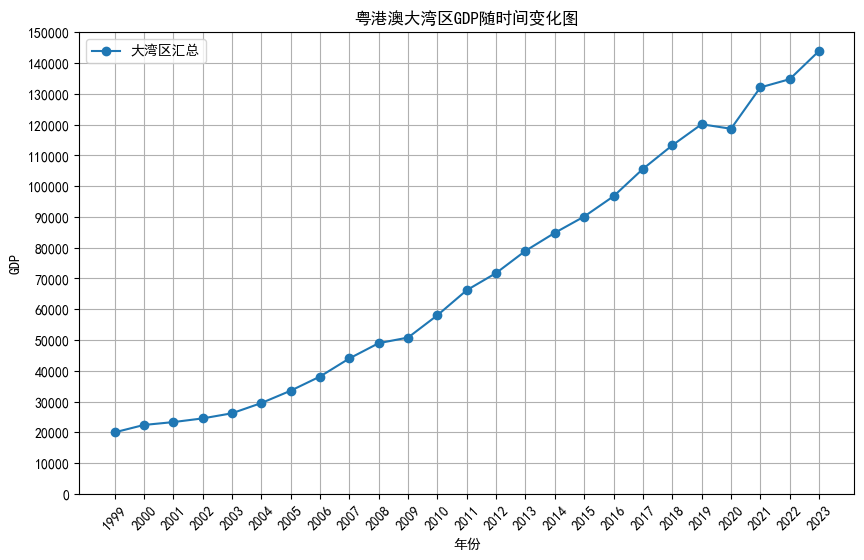

```python
import pandas as pd
import numpy as np
import os

from openpyxl.chart.marker import Marker
from scipy.interpolate import interp1d
import statsmodels.api as sm
```

下读入五个显著相关的数据（科研投入、高新企业数量、出口货物、零售、就业情况），并对缺失数据进行线性插值和数据外推处理。


```python
data_dir = os.path.join(os.getcwd(), 'data')

gdp_data = pd.read_excel(os.path.join(data_dir,'GDP.xlsx'))
factors = ['科研投入', '高科技企业数量', '出口货值', '零售', '就业情况']
factors_data = [pd.read_excel(os.path.join(data_dir, f'selected', f'{factor}.xlsx')) for factor in factors]

def interpolate(data, start, end):
    x = data['年份']
    y = data['大湾区汇总'].interpolate(method='linear')
    # 进行数据外推，针对'科研投入'和'高科技企业数量'两个因素
    f = interp1d(x, y, kind='linear', bounds_error=False, fill_value="extrapolate")
    new_x = np.arange(start, end + 1)
    new_y = f(new_x)
    new_y = np.maximum(new_y, 0)
    return pd.Series(new_y, index=new_x)

all_factors = pd.DataFrame(index=range(1999,2024))

cnt = 0
for factor in factors_data:
    interpolated_data = interpolate(factor, 1999, 2024)
    # 防止有遗漏的NA值
    interpolated_data = interpolated_data.interpolate(method='linear')
    all_factors[factors[cnt]] = interpolated_data
    cnt += 1
print(all_factors)
```

             科研投入  高科技企业数量         出口货值           零售       就业情况
    1999     0.00      0.0  2079.020000   2102.66000  1758.6600
    2000     0.00      0.0  2428.210700   3290.77000  2243.1900
    2001     0.00      0.0  2339.230000   3497.10000  2292.8900
    2002     0.00      0.0  2547.390000   3913.14000  2376.4200
    2003     0.00      0.0  2915.390000   4402.42000  2590.0300
    2004     0.00      0.0  3451.980000   5019.48000  2841.5300
    2005     0.00      0.0  3909.402337   8148.64000  3180.0100
    2006     0.00      0.0  4397.810000   8967.24000  3358.8400
    2007     0.00      0.0  4946.930000  10514.23000  3484.3724
    2008   149.46      0.0  5292.050000  12464.94000  3614.9962
    2009   359.21      0.0  4618.630000  13805.69000  3790.0489
    2010   568.96      0.0  5702.567179  16617.22000  4060.7400
    2011   778.71      0.0  6342.228130  19608.02000  4020.6155
    2012   988.46      0.0  6612.590000  21789.56000  4038.9700
    2013  1198.21      0.0  6986.815800  24243.11000  4431.9400
    2014  1407.96   1055.0  7315.999500  26865.68000  4621.2800
    2015  1617.71  10356.0  7299.624390  28778.54000  4760.5900
    2016  1827.46  19657.0  7131.132785  30703.19000  4936.7700
    2017  2037.21  28958.0  7592.618236  33459.44000  5109.0600
    2018  2246.96  38259.0  8160.190000  36416.62000  5296.7200
    2019  2460.96  45926.0  7891.019711  38321.08000  5261.9800
    2020  2653.79  48325.0  7814.201300  34928.82000  5319.7500
    2021  4007.42  55560.0  9886.539580  38683.14653  5354.2200
    2022  4007.42  55560.0  9241.036143  39036.20000  5161.4800
    2023  4007.42  55560.0  8373.665171  41966.67000  4968.7400
    

下构建多元线性回归模型


```python
X = all_factors
Y = gdp_data['大湾区汇总']
Y.index = gdp_data['年']

# 使用statsmodel库构建多元线性回归模型
X = sm.add_constant(X)
model = sm.OLS(Y, X)
results = model.fit()

print(results.summary())
```

                                OLS Regression Results                            
    ==============================================================================
    Dep. Variable:                  大湾区汇总   R-squared:                       0.998
    Model:                            OLS   Adj. R-squared:                  0.998
    Method:                 Least Squares   F-statistic:                     2189.
    Date:                Fri, 08 Nov 2024   Prob (F-statistic):           1.55e-25
    Time:                        02:36:47   Log-Likelihood:                -220.75
    No. Observations:                  25   AIC:                             453.5
    Df Residuals:                      19   BIC:                             460.8
    Df Model:                           5                                         
    Covariance Type:            nonrobust                                         
    ==============================================================================
                     coef    std err          t      P>|t|      [0.025      0.975]
    ------------------------------------------------------------------------------
    const       1.246e+04   3853.930      3.233      0.004    4394.563    2.05e+04
    科研投入           6.2164      2.068      3.006      0.007       1.888      10.545
    高科技企业数量        0.1391      0.069      2.008      0.059      -0.006       0.284
    出口货值           1.0911      1.186      0.920      0.369      -1.391       3.574
    零售             1.9093      0.226      8.456      0.000       1.437       2.382
    就业情况           0.9989      2.653      0.376      0.711      -4.555       6.552
    ==============================================================================
    Omnibus:                        4.957   Durbin-Watson:                   1.501
    Prob(Omnibus):                  0.084   Jarque-Bera (JB):                3.111
    Skew:                           0.788   Prob(JB):                        0.211
    Kurtosis:                       3.709   Cond. No.                     3.53e+05
    ==============================================================================
    
    Notes:
    [1] Standard Errors assume that the covariance matrix of the errors is correctly specified.
    [2] The condition number is large, 3.53e+05. This might indicate that there are
    strong multicollinearity or other numerical problems.
    

最终得到
**大湾区的GDP多元线性回归模型方程**

**GDP** = **6.2164** × 科研投入 + **0.1391** × 高科技企业数量 + **1.0911** × 出口货值 + **1.9093** × 零售 + **0.9989** × 就业情况 + **12460**

其中：
- 6.2164 是科研投入的系数。
- 0.1391 是高科技企业数量的系数。
- 1.0911 是出口货值的系数。
- 1.9093 是零售的系数。
- 0.9989 是就业情况的系数。
- 12460 是常数项。


```python
import matplotlib
import matplotlib.pyplot as plt

matplotlib.rcParams['font.sans-serif'] = ['SimHei']
plt.figure(figsize=(10, 6))
for column in all_factors.columns:
    plt.plot(all_factors.index, all_factors[column], marker='o', label=column)
    
plt.legend()

plt.title('粤港澳大湾区影响GDP的因素随时间变化图')
plt.xlabel('年份')
plt.ylabel('数值')

plt.show()
```


    

    


```python
plt.figure(figsize=(10, 6))
gdp_data.index = range(1999,2024)
plt.plot(gdp_data.index, gdp_data['大湾区汇总'], marker='o', label='大湾区汇总')
    
plt.legend()

plt.title('粤港澳大湾区GDP随时间变化图')
plt.xlabel('年份')
plt.ylabel('GDP')
plt.xticks(gdp_data.index, rotation=45)
plt.yticks(range(0,160000,10000))
plt.grid(True)

plt.show()
```


    

    

